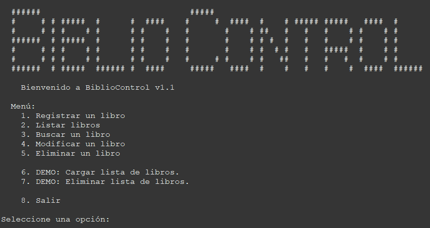

<div id="gotop"></div>

<div align="center">
  [<a href="README.md">English</a>] | [<a href="docs/README-ES.md">Español</a>]
</div>

<br>

 <!-- BANNER -->
<div align="center">
  <picture>
    <source media="(prefers-color-scheme: dark)" srcset="./imgs/logo-dark.png">
    
  </picture>
  <hr>
  <p> Library Management Project - Comprehensive Practical Work<br>Object Oriented Programming </p>
  <hr>
</div>

<div align="center">
  
[](https://github.com/danielcshn/bibliocontrol/issues)
[](https://github.com/danielcshn/bibliocontrol/watchers)
[](https://github.com/danielcshn/bibliocontrol/fork)
[](https://github.com/danielcshn/bibliocontrol/stargazers)
[](https://github.com/danielcshn/bibliocontrol/blob/main/LICENSE)
[](https://github.com/danielcshn/bibliocontrol/commits/main)
[![ESBA - Barrio Norte](https://img.shields.io/badge/ESBA_Barrio_Norte-white?style=for-the-badge&logo=data:image/jpeg;base64,/9j/4AAQSkZJRgABAQAAAQABAAD/4gHYSUNDX1BST0ZJTEUAAQEAAAHIAAAAAAQwAABtbnRyUkdCIFhZWiAH4AABAAEAAAAAAABhY3NwAAAAAAAAAAAAAAAAAAAAAAAAAAAAAAAAAAAAAQAA9tYAAQAAAADTLQAAAAAAAAAAAAAAAAAAAAAAAAAAAAAAAAAAAAAAAAAAAAAAAAAAAAAAAAAAAAAAAAAAAAlkZXNjAAAA8AAAACRyWFlaAAABFAAAABRnWFlaAAABKAAAABRiWFlaAAABPAAAABR3dHB0AAABUAAAABRyVFJDAAABZAAAAChnVFJDAAABZAAAAChiVFJDAAABZAAAAChjcHJ0AAABjAAAADxtbHVjAAAAAAAAAAEAAAAMZW5VUwAAAAgAAAAcAHMAUgBHAEJYWVogAAAAAAAAb6IAADj1AAADkFhZWiAAAAAAAABimQAAt4UAABjaWFlaIAAAAAAAACSgAAAPhAAAts9YWVogAAAAAAAA9tYAAQAAAADTLXBhcmEAAAAAAAQAAAACZmYAAPKnAAANWQAAE9AAAApbAAAAAAAAAABtbHVjAAAAAAAAAAEAAAAMZW5VUwAAACAAAAAcAEcAbwBvAGcAbABlACAASQBuAGMALgAgADIAMAAxADb/2wBDAAMCAgICAgMCAgIDAwMDBAYEBAQEBAgGBgUGCQgKCgkICQkKDA8MCgsOCwkJDRENDg8QEBEQCgwSExIQEw8QEBD/2wBDAQMDAwQDBAgEBAgQCwkLEBAQEBAQEBAQEBAQEBAQEBAQEBAQEBAQEBAQEBAQEBAQEBAQEBAQEBAQEBAQEBAQEBD/wAARCAAgACADASIAAhEBAxEB/8QAFwABAQEBAAAAAAAAAAAAAAAACAkFBv/EAC8QAAEDAgUDAQYHAAAAAAAAAAIDBAUGBwABEiIyCAkTchEUI0FzkhUhKDFEYqT/xAAXAQADAQAAAAAAAAAAAAAAAAABAgMG/8QAKREAAQIEBAQHAAAAAAAAAAAAAgMEAAEFEgYTQYERIVFhIjEyQmJx0f/aAAwDAQACEQMRAD8AqYqokimSyx5CA7izz+WJ09VHdPSt5WgUVYeOiZ8oxfTLyT8TUbKEP7ooaCHV9TCP635OoIyyuZRFOSE82WlW6EnHM5A2RO2ZZFrSJYdwplt1afTif8fdiUoZNY6F6OrTw5M9ReaSIn6m1dshzIt252ljVYcpSTgZuFU8z48ZSlvrEVFPbCAs33X0ayWRj6ysVVOS/FRxTiJSCfq8ekSw1bXXWpG8VLZVdRbp2oxycqslQdtFWq6LhPP4iSiSoiQkOJ0wF+OuysKhj6Up+ZtzSOT6ppWk0/cYkdKLxih5F+Qlt08Swru3qpWMl09DVddP03svUk/KyqrgNPxdS+jVpHjuTLbha5TEWyeeAiPlyEruvbt1hkyKN7rXr6kKAsm5f1dMAwRdvUWyHtAjJRTdtER/PE43NcURPM5JWGqWPdCqgvtFcdRapSHLj6RL7SxW64NsrfXYhRgLi0fGVDHiXlTSfNxU8Z6eQ/MS9OCVc3tNdPNWmq8oiQnKNeFuEWq/vLbV9NTd9pYph6rMGKWU5mQz47fsKoJF6Y4O1ibcrpU+bcxUErz1yWod38E8J7oPz/S7SAZ58TkB/wBq+AnUnbY6vrRSCM9Za5aE3+GuVXbQW8gTJymqQ6SUFNT4Woh28sMDt5FdSnrNOLZXcomRp2WpCQUTRJ0gQ5PG65Er5PJxULWSnH+uK1wWxsr2y0j5y+9dN4Cd13ij/9k=)](https://esbabarrionorte.edu.ar/)

</div>

## 📸 Screenshots

<div align="center">
  <a href="https://github.com/danielcshn/bibliocontrol/">
    
  </a>
</div>

---

## 📝 Prerequisites

- [Java](https://www.oracle.com/java/technologies/downloads/) - v8 / JDK 21
- [Eclipse IDE for Java Developers](https://www.eclipse.org/downloads/packages/installer) - v2023-06 (4.28.0) - Build: 20230608-1333
- [Microsoft Windows](https://www.microsoft.com/windows) - v10 or high

---

## 🐛 Bug reports

Please feel free to submit bug reports on the github issue tracker at https://github.com/danielcshn/bibliocontrol/issues

---

## 👷 Contributing

We currently not accept any contributions to the code. Thanks for understand.

---

## 📝 License

```
MIT License

Copyright (c) 2023 danielcshn

Permission is hereby granted, free of charge, to any person obtaining a copy
of this software and associated documentation files (the "Software"), to deal
in the Software without restriction, including without limitation the rights
to use, copy, modify, merge, publish, distribute, sublicense, and/or sell
copies of the Software, and to permit persons to whom the Software is
furnished to do so, subject to the following conditions:

The above copyright notice and this permission notice shall be included in all
copies or substantial portions of the Software.

THE SOFTWARE IS PROVIDED "AS IS", WITHOUT WARRANTY OF ANY KIND, EXPRESS OR
IMPLIED, INCLUDING BUT NOT LIMITED TO THE WARRANTIES OF MERCHANTABILITY,
FITNESS FOR A PARTICULAR PURPOSE AND NONINFRINGEMENT. IN NO EVENT SHALL THE
AUTHORS OR COPYRIGHT HOLDERS BE LIABLE FOR ANY CLAIM, DAMAGES OR OTHER
LIABILITY, WHETHER IN AN ACTION OF CONTRACT, TORT OR OTHERWISE, ARISING FROM,
OUT OF OR IN CONNECTION WITH THE SOFTWARE OR THE USE OR OTHER DEALINGS IN THE
SOFTWARE.
```

---

<!-- Back to Top -->
<!-- Arrow Square Up SVG Vector
COLLECTION: Dazzle Line Icons
LICENSE: CC Attribution License
AUTHOR: Dazzle UI
URL: https://www.svgrepo.com/svg/533629/arrow-square-up
 -->
<p align="right">
<a href="#gotop">
<picture>
  <source media="(prefers-color-scheme: dark)" srcset="https://raw.githubusercontent.com/danielcshn/danielcshn/master/icons/arrow-square-up-fac539.svg">
  
</picture>
</a>
</p>